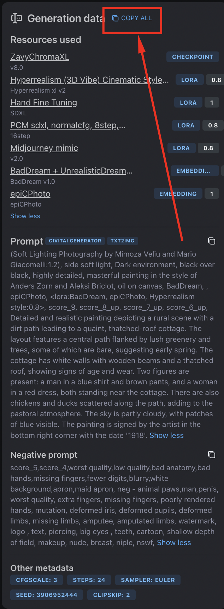

# FH1.0 CivitAI generation data standard

Here I'm proposing a new specification for the generation data (including metadata) extending the existing CivitAI and Automatic1111 image metadata/generation data for AI generated images.

**Why a new spec?**

The existing spec misses out a few details like the "triggerWord" for the embedding networks and the lora weights.
It's the exact same spec but the "Additional networks" section includes more info, specifically the weights and the triggerWord.

The old format is `Additional networks: modelURN` (example: `Additional networks: urn:air:sd1:embedding:civitai:7808@9208`)

The new format with `weight=1.66` and `triggerWord=easyNegative`: `Additional networks: modelURN*weight!triggerWord` (example: `Additional networks: urn:air:sd1:embedding:civitai:7808@9208*1.66!easyNegative`)


We will use this as our [example image](https://civitai.com/images/21884310) for the spec.


If you visit the [`getGenerationData` API endpoint](https://civitai.com/api/trpc/image.getGenerationData?input=%7B%22json%22%3A%7B%22id%22%3A21884310%2C%22authed%22%3Atrue%7D%7D) you will find the full generation data.

<details>
<summary>Click to expand full API response JSON</summary>


```json
{
    "result": {
        "data": {
            "json": {
                "type": "image",
                "onSite": true,
                "process": "txt2img",
                "meta": {
                    "prompt": "(Soft Lighting Photography by Mimoza Veliu and Mario Giacomelli:1.2), side soft light, Dark environment, black over black, highly detailed, masterful painting in the style of Anders Zorn and Aleksi Briclot, oil on canvas, BadDream, , epiCPhoto, <lora:BadDream, epiCPhoto, Hyperrealism style:0.8>, score_9, score_8_up, score_7_up, score_6_up, \nDetailed and realistic painting depicting a rural scene with a dirt path leading to a quaint, thatched-roof cottage. The layout features a central path flanked by lush greenery and trees, some of which are bare, suggesting early spring. The cottage has white walls with wooden beams and a thatched roof, showing signs of age and wear. Two figures are present: a man in a blue shirt and brown pants, and a woman in a red dress, both standing near the cottage. There are also chickens and ducks scattered along the path, adding to the pastoral atmosphere. The sky is partly cloudy, with patches of blue visible. The painting is signed by the artist in the bottom right corner with the date '1918'.",
                    "negativePrompt": "score_5,score_4,worst quality,low quality,bad anatomy,bad hands,missing fingers,fewer digits,blurry,white background,apron,maid apron, neg - animal paws,man,penis, worst quality, extra fingers, missing fingers, poorly rendered hands, mutation, deformed iris, deformed pupils, deformed limbs, missing limbs, amputee, amputated limbs, watermark, logo , text, piercing, big eyes , teeth, cartoon, shallow depth of field, makeup, nude, breast, niple, nswf,",
                    "cfgScale": 3,
                    "steps": 24,
                    "sampler": "Euler",
                    "seed": 3906952444,
                    "civitaiResources": [
                        {
                            "type": "checkpoint",
                            "modelVersionId": 563988
                        },
                        {
                            "type": "embed",
                            "weight": 1,
                            "modelVersionId": 77169
                        },
                        {
                            "type": "embed",
                            "weight": 1,
                            "modelVersionId": 220262
                        },
                        {
                            "type": "lora",
                            "weight": 0.8,
                            "modelVersionId": 349880
                        },
                        {
                            "type": "lora",
                            "weight": 0.8,
                            "modelVersionId": 545175
                        },
                        {
                            "type": "lora",
                            "weight": 1,
                            "modelVersionId": 358694
                        },
                        {
                            "type": "lora",
                            "weight": 0.8,
                            "modelVersionId": 678485
                        }
                    ],
                    "Size": "832x1216",
                    "Created Date": "2024-07-29T1605:46.4544993Z",
                    "clipSkip": 2
                },
                "resources": [
                    {
                        "imageId": 21884310,
                        "modelVersionId": 77169,
                        "strength": 1,
                        "modelId": 72437,
                        "modelName": "BadDream + UnrealisticDream (Negative Embeddings)",
                        "modelType": "TextualInversion",
                        "versionId": 77169,
                        "versionName": "BadDream v1.0",
                        "baseModel": "SD 1.5"
                    },
                    {
                        "imageId": 21884310,
                        "modelVersionId": 220262,
                        "strength": 1,
                        "modelId": 195911,
                        "modelName": "epiCPhoto",
                        "modelType": "TextualInversion",
                        "versionId": 220262,
                        "versionName": "epiCPhoto",
                        "baseModel": "SD 1.5"
                    },
                    {
                        "imageId": 21884310,
                        "modelVersionId": 349880,
                        "strength": 0.8,
                        "modelId": 185722,
                        "modelName": "Hyperrealism (3D Vibe) Cinematic Style XL + F1D",
                        "modelType": "LORA",
                        "versionId": 349880,
                        "versionName": "Hyperrealism  xl v2",
                        "baseModel": "SDXL 1.0"
                    },
                    {
                        "imageId": 21884310,
                        "modelVersionId": 358694,
                        "strength": 1,
                        "modelId": 278497,
                        "modelName": "Hand Fine Tuning",
                        "modelType": "LORA",
                        "versionId": 358694,
                        "versionName": "SDXL",
                        "baseModel": "SDXL 1.0"
                    },
                    {
                        "imageId": 21884310,
                        "modelVersionId": 545175,
                        "strength": 0.8,
                        "modelId": 490267,
                        "modelName": "PCM sdxl, normalcfg, 8step, converted_fp16",
                        "modelType": "LORA",
                        "versionId": 545175,
                        "versionName": "16step",
                        "baseModel": "SDXL 1.0"
                    },
                    {
                        "imageId": 21884310,
                        "modelVersionId": 563988,
                        "strength": null,
                        "modelId": 119229,
                        "modelName": "ZavyChromaXL",
                        "modelType": "Checkpoint",
                        "versionId": 563988,
                        "versionName": "v8.0",
                        "baseModel": "SDXL 1.0"
                    },
                    {
                        "imageId": 21884310,
                        "modelVersionId": 678485,
                        "strength": 0.8,
                        "modelId": 251417,
                        "modelName": "Midjourney mimic",
                        "modelType": "LORA",
                        "versionId": 678485,
                        "versionName": "v2.0",
                        "baseModel": "SDXL 1.0"
                    }
                ],
                "tools": [],
                "techniques": [],
                "external": null,
                "canRemix": true,
                "remixOfId": null
            },
            "meta": {
                "values": {
                    "resources.5.strength": [
                        "undefined"
                    ],
                    "external": [
                        "undefined"
                    ],
                    "remixOfId": [
                        "undefined"
                    ]
                }
            }
        }
    }
}
```

</details>


here's the generation data from pressing teh "copy all" button:


```
(Soft Lighting Photography by Mimoza Veliu and Mario Giacomelli:1.2), side soft light, Dark environment, black over black, highly detailed, masterful painting in the style of Anders Zorn and Aleksi Briclot, oil on canvas, BadDream, , epiCPhoto, <lora:BadDream, epiCPhoto, Hyperrealism style:0.8>, score_9, score_8_up, score_7_up, score_6_up, 
Detailed and realistic painting depicting a rural scene with a dirt path leading to a quaint, thatched-roof cottage. The layout features a central path flanked by lush greenery and trees, some of which are bare, suggesting early spring. The cottage has white walls with wooden beams and a thatched roof, showing signs of age and wear. Two figures are present: a man in a blue shirt and brown pants, and a woman in a red dress, both standing near the cottage. There are also chickens and ducks scattered along the path, adding to the pastoral atmosphere. The sky is partly cloudy, with patches of blue visible. The painting is signed by the artist in the bottom right corner with the date '1918'.
Negative prompt: score_5,score_4,worst quality,low quality,bad anatomy,bad hands,missing fingers,fewer digits,blurry,white background,apron,maid apron, neg - animal paws,man,penis, worst quality, extra fingers, missing fingers, poorly rendered hands, mutation, deformed iris, deformed pupils, deformed limbs, missing limbs, amputee, amputated limbs, watermark, logo , text, piercing, big eyes , teeth, cartoon, shallow depth of field, makeup, nude, breast, niple, nswf,
Steps: 24, CFG scale: 3, Sampler: Euler, Seed: 3906952444, Size: 832x1216, Created Date: 2024-07-29T1605:46.4544993Z, Clip skip: 2
```

And here's what you'd get with my new FH1.0 spec:

```
(Soft Lighting Photography by Mimoza Veliu and Mario Giacomelli:1.2), side soft light, Dark environment, black over black, highly detailed, masterful painting in the style of Anders Zorn and Aleksi Briclot, oil on canvas, BadDream, , epiCPhoto, <lora:BadDream, epiCPhoto, Hyperrealism style:0.8>, score_9, score_8_up, score_7_up, score_6_up, 
Detailed and realistic painting depicting a rural scene with a dirt path leading to a quaint, thatched-roof cottage. The layout features a central path flanked by lush greenery and trees, some of which are bare, suggesting early spring. The cottage has white walls with wooden beams and a thatched roof, showing signs of age and wear. Two figures are present: a man in a blue shirt and brown pants, and a woman in a red dress, both standing near the cottage. There are also chickens and ducks scattered along the path, adding to the pastoral atmosphere. The sky is partly cloudy, with patches of blue visible. The painting is signed by the artist in the bottom right corner with the date '1918'.
Negative prompt: score_5,score_4,worst quality,low quality,bad anatomy,bad hands,missing fingers,fewer digits,blurry,white background,apron,maid apron, neg - animal paws,man,penis, worst quality, extra fingers, missing fingers, poorly rendered hands, mutation, deformed iris, deformed pupils, deformed limbs, missing limbs, amputee, amputated limbs, watermark, logo , text, piercing, big eyes , teeth, cartoon, shallow depth of field, makeup, nude, breast, niple, nswf,
Additional networks: urn:air:sd1:embed:civitai:72437@77169*1!BadDream, urn:air:sd1:embed:civitai:195911@220262*1!epiCPhoto, urn:air:sdxl:lora:civitai:185722@349880*0.8, urn:air:sdxl:lora:civitai:278497@358694*1, urn:air:sdxl:lora:civitai:490267@545175*0.8, urn:air:sdxl:lora:civitai:251417@678485*0.8
baseModel: SDXL 1.0, Model: urn:air:sdxl:checkpoint:civitai:119229@563988, Cfg scale: 3, Steps: 24, Sampler: Euler, Seed: 3906952444, Size: 832x1216, Created Date: 2024-07-29T1605:46.4544993Z, Clip skip: 2
```


```diff
(Soft Lighting Photography by Mimoza Veliu and Mario Giacomelli:1.2), side soft light, Dark environment, black over black, highly detailed, masterful painting in the style of Anders Zorn and Aleksi Briclot, oil on canvas, BadDream, , epiCPhoto, <lora:BadDream, epiCPhoto, Hyperrealism style:0.8>, score_9, score_8_up, score_7_up, score_6_up, 
Detailed and realistic painting depicting a rural scene with a dirt path leading to a quaint, thatched-roof cottage. The layout features a central path flanked by lush greenery and trees, some of which are bare, suggesting early spring. The cottage has white walls with wooden beams and a thatched roof, showing signs of age and wear. Two figures are present: a man in a blue shirt and brown pants, and a woman in a red dress, both standing near the cottage. There are also chickens and ducks scattered along the path, adding to the pastoral atmosphere. The sky is partly cloudy, with patches of blue visible. The painting is signed by the artist in the bottom right corner with the date '1918'.
Negative prompt: score_5,score_4,worst quality,low quality,bad anatomy,bad hands,missing fingers,fewer digits,blurry,white background,apron,maid apron, neg - animal paws,man,penis, worst quality, extra fingers, missing fingers, poorly rendered hands, mutation, deformed iris, deformed pupils, deformed limbs, missing limbs, amputee, amputated limbs, watermark, logo , text, piercing, big eyes , teeth, cartoon, shallow depth of field, makeup, nude, breast, niple, nswf,
- Steps: 24, CFG scale: 3, Sampler: Euler, Seed: 3906952444, Size: 832x1216, Created Date: 2024-07-29T1605:46.4544993Z, Clip skip: 2
+ Additional networks: urn:air:sd1:embed:civitai:72437@77169*1!BadDream, urn:air:sd1:embed:civitai:195911@220262*1!epiCPhoto, urn:air:sdxl:lora:civitai:185722@349880*0.8, urn:air:sdxl:lora:civitai:278497@358694*1, urn:air:sdxl:lora:civitai:490267@545175*0.8, urn:air:sdxl:lora:civitai:251417@678485*0.8
+ baseModel: SDXL 1.0, Model: urn:air:sdxl:checkpoint:civitai:119229@563988, CFG scale: 3, Steps: 24, Sampler: Euler, Seed: 3906952444, Size: 832x1216, Created Date: 2024-07-29T1605:46.4544993Z, Clip skip: 2
```


breakdown:
- the first many lines are the "prompt"
- later there's the "negativePrompt" (optional)
- and then there's the "additionalNetworks" (optional)
- and then there's the "more_metadata" section which are key-value pairs
